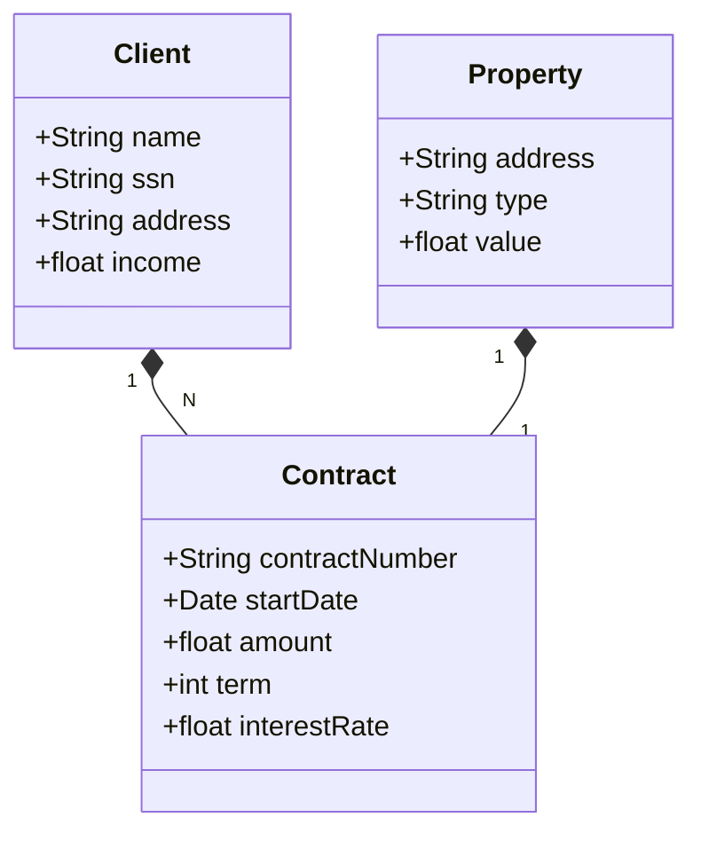

# Entrega do desafio desenvolvendo API RestFUL com Spring Boot, JPA, Swagger e Deploy no Railway

## Tecnologias Utilizadas

- **Spring Boot**: Framework para criação de aplicações Java baseadas em microserviços.
- **Spring Data JPA**: Implementação da camada de persistência baseada em JPA (Java Persistence API).
- **Swagger**: Ferramenta para documentação de APIs RESTful.
- **Railway**: Plataforma para deploy de aplicações web.

## Diagrama de classe

