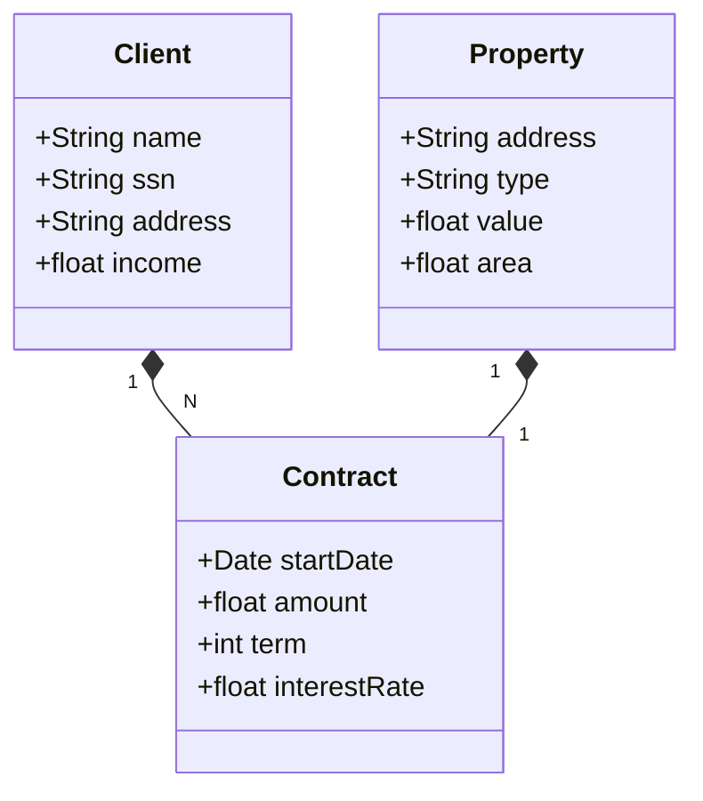

```mermaid
classDiagram

    class Property {
        +String address
        +String type
        +float value
        +float area
    }

    class Client {
        +String name
        +String ssn
        +String address
        +float income
    }

    class Contract {
        +Date startDate
        +float amount
        +int term
        +float interestRate
    }

  Client "1" *-- "N" Contract 
    Property "1" *-- "1" Contract
    
```
