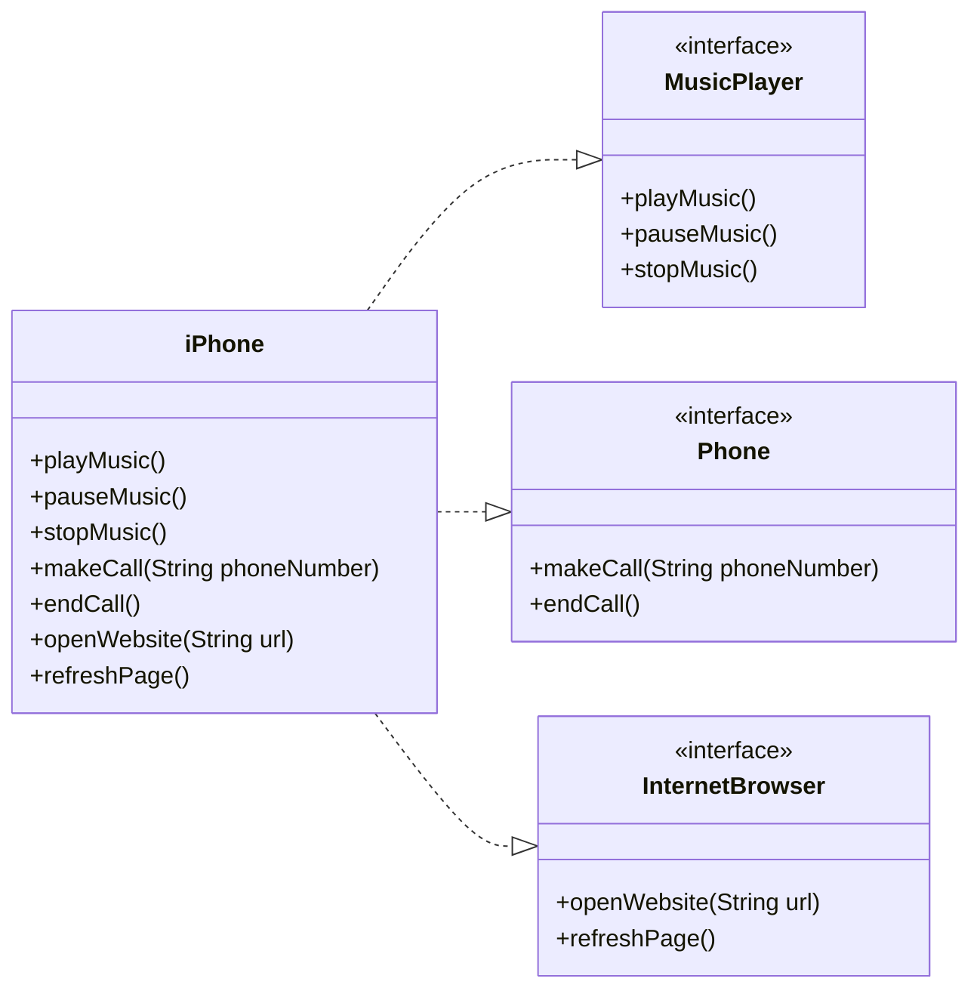

# iPhone Functionalities UML Diagram

Este diagrama de classes UML representa as funcionalidades do iPhone como Reprodutor Musical, Aparelho Telefônico e Navegador na Internet, conforme apresentado no vídeo de lançamento do primeiro iPhone por Steve Jobs em 2007.

### Explicação

- **MusicPlayer**: Interface que define métodos para tocar, pausar e parar música.
- **Phone**: Interface que define métodos para fazer e encerrar chamadas.
- **InternetBrowser**: Interface que define métodos para abrir um site e atualizar a página.
- **iPhone**: Classe que implementa todas as três interfaces, provendo funcionalidades de reprodutor musical, aparelho telefônico e navegador na internet.

